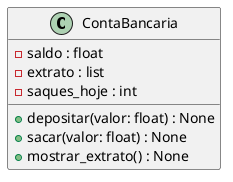

## Criando um Sistema Bancário com Python

**Bootcamp Suzano - Python Developer #2**

---

# 🏦 Sistema Bancário em Python

> Projeto desenvolvido em **Python 3**, aplicando os conceitos de **Programação Orientada a Objetos (POO)** para simular operações bancárias básicas: depósito, saque e extrato — com regras de negócio bem definidas e código limpo.

---

## ✨ Funcionalidades

- 💰 **Depósito**
  - Aceita apenas valores positivos.
  - Atualiza automaticamente o saldo da conta.

- 💸 **Saque**
  - Limite de **3 saques diários**.
  - Limite máximo de **R$ 500,00 por saque**.
  - Verifica saldo disponível antes de efetuar a operação.

- 📄 **Extrato**
  - Exibe todas as transações realizadas.
  - Mostra o saldo final formatado (`R$ xxx.xx`).
  - Caso não existam movimentações, informa que não há operações.

---

## 🧠 Conceitos Aplicados

- ✅ **Programação Orientada a Objetos (POO)**  
  Organização da lógica em classes e métodos (`ContaBancaria`).

- 🧭 **Separação de responsabilidades**  
  Interface do usuário isolada da lógica de negócio.

- 📝 **Código limpo e comentado**  
  Facilita leitura, manutenção e evolução do sistema.

- 🧱 **Estrutura modular**  
  Ideal para reuso e expansão futura (ex: múltiplas contas, interface gráfica ou API).

---

## 📂 Estrutura do Projeto

---

---

## 🌐 Caminho Completo dos Arquivos

| Arquivo       | Caminho Completo no Repositório                                                                 | Descrição                                                                                                         |
|--------------|--------------------------------------------------------------------------------------------------|-------------------------------------------------------------------------------------------------------------------|
| `README.md`   | [README.md](https://github.com/Santosdevbjj/sistemaBancario/blob/main/README.md)                 | Documentação inicial do projeto.                                                                                  |
| `.gitignore`  | [.gitignore](https://github.com/Santosdevbjj/sistemaBancario/blob/main/.gitignore)               | Define arquivos a serem ignorados pelo Git (ex: cache, ambientes virtuais).                                      |
| `__init__.py` | [app/__init__.py](https://github.com/Santosdevbjj/sistemaBancario/blob/main/app/__init__.py)     | Marca a pasta `app` como um pacote Python.                                                                       |
| `conta.py`    | [app/conta.py](https://github.com/Santosdevbjj/sistemaBancario/blob/main/app/conta.py)           | Contém a classe `ContaBancaria` — a lógica central do negócio (estado e comportamento da conta).                  |
| `main.py`     | [app/main.py](https://github.com/Santosdevbjj/sistemaBancario/blob/main/app/main.py)            | Ponto de entrada da aplicação: interface de usuário (menu) e execução principal do programa.                      |

---

## 🧠 Implementação do Código

O **coração do sistema** está na classe `ContaBancaria`, localizada em [`app/conta.py`](https://github.com/Santosdevbjj/sistemaBancario/blob/main/app/conta.py).  
Essa classe encapsula **o estado** e **o comportamento** da conta bancária:

- **Estado**  
  - `saldo` → valor atual disponível.  
  - `extrato` → lista de transações realizadas.  
  - `saques_hoje` → contador de saques diários.

- **Comportamentos (métodos)**  
  - `depositar(valor)` → adiciona valor ao saldo se for positivo.  
  - `sacar(valor)` → aplica as regras de limite diário e por saque.  
  - `mostrar_extrato()` → exibe transações e saldo formatado.

Toda a lógica de regras de negócio foi implementada dentro dessa classe, seguindo boas práticas de encapsulamento e reutilização.

---

## 📊 Diagrama UML da Classe `ContaBancaria`

A seguir, um **diagrama UML simples** para representar visualmente a estrutura da classe principal do sistema:

**Legenda:**

Sinais de + representam membros públicos (métodos acessíveis externamente).

Sinais de - representam atributos privados (estado interno da classe).

O diagrama acima segue o padrão UML Class Diagram.

Você pode visualizar esse diagrama diretamente usando extensões do VS Code (ex: PlantUML) ou sites como PlantText e PlantUML Online.

---

**Como Executar o Projeto**

1. Clone o repositório

git clone https://github.com/Santosdevbjj/sistemaBancario.git

2. Acesse a pasta do projeto

cd sistemaBancario/app

3. Execute o arquivo principal

python main.py

4. **O sistema exibirá um menu interativo no terminal, com opções para:**

Depositar

Sacar

Consultar extrato

Sair

---

🧪 **Exemplo de Uso**

=> Escolha uma opção: d
Informe o valor do depósito: 200
Depósito de R$ 200.00 realizado com sucesso!

---

🛠️ **Tecnologias Utilizadas**

Tecnologia	Uso Principal

🐍 Python 3	Lógica do sistema
🧠 POO	Estruturação do código
💻 CLI (Interface de Linha de Comando)	Interação com o usuário

---

📌 **Possíveis Extensões Futuras**

[ ] Suporte para múltiplas contas

[ ] Persistência em banco de dados ou arquivos

[ ] Interface gráfica (Tkinter ou PyQt)

[ ] API REST com FastAPI ou Flask

---

🤝 **Contribuindo**

Contribuições são bem-vindas!
Para contribuir:

1. Faça um fork do projeto

2. Crie uma branch para sua feature ou correção

3. Envie um pull request 🚀

---

👨‍💻 **Autor**

Sérgio Santos
💼 Profissional de TI | Programador | Analista de Sistemas

 

---

📝 **Licença**

Este projeto está licenciado sob a Licença MIT.
Consulte o arquivo LICENSE para mais detalhes.

---

🌟 **Agradecimentos**

Projeto inspirado em desafios de lógica e exercícios de POO para prática de fundamentos de programação.
Ideal para quem está começando com Python e quer aprender boas práticas desde o início.

